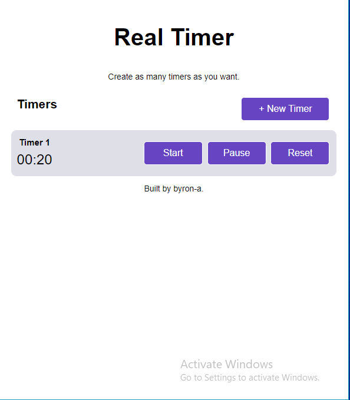
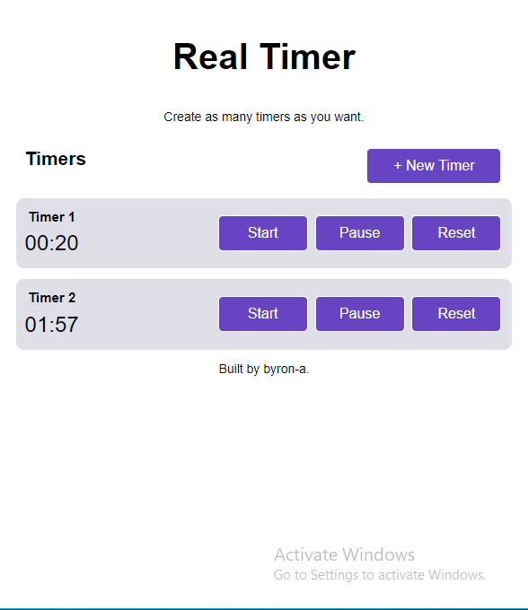
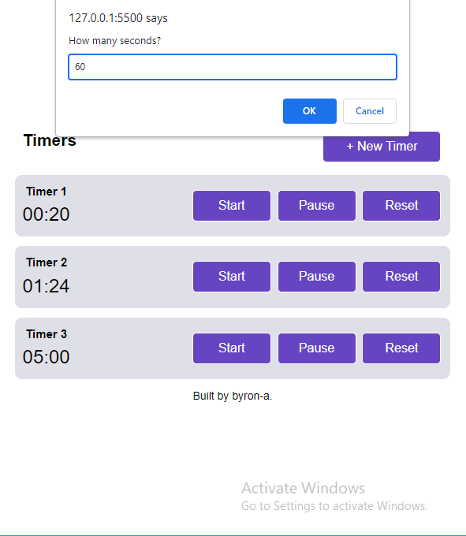

# Real Timer
Create and set as many timers as you want.

### Screenshots

## Code Overview

This is a multi-timer application where the users will be able to set multiple timers and each timer will be able to run independently. I used setInterval() to countdown, and each timer object the user creates will contain key properties like the current time, original time set, and the current state. Each timer object will be stored in an array.

## Link

Online [live site]()